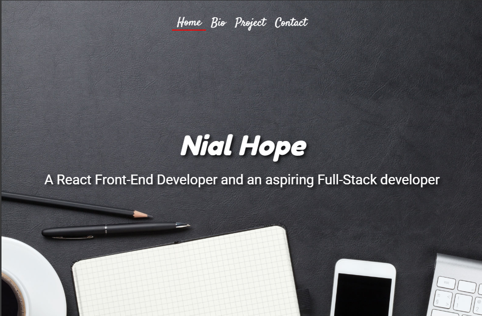

# My 2022 Web Development Portfolio

Welcome to my **Web Development Portfolio**! This project showcases my skills and experience as a web developer. Built with **React**, **Emailjs**, **React Router**, **Google ReCaptcha**, and other modern web development technologies, this portfolio highlights my ability to create responsive, accessible, and high-performance web applications.

## 💼 About Me

I'm a passionate **frontend developer** with a focus on building dynamic, user-friendly web applications. I enjoy solving problems through clean, efficient code and love experimenting with new frameworks and libraries to enhance user experiences.

- 🔭 I’m currently working on **React & Node.js projects**.
- 🌱 I’m always learning new technologies and improving my development skills.
- 👯 I’m looking to collaborate on **open-source** and **full-stack** projects.
- 💬 Ask me about **React**, **Node.js**, and **Web Accessibility**.
- 📫 How to reach me: [LinkedIn](https://www.linkedin.com/in/nialhope/)

## 🚀 Technologies Used

- **React** (React 17, React Router, Context API, Hooks)
- **npm** (Package Management)
- **Redux** (State Management)
- **Node.js** (for backend projects)

## 📁 Features

- **Interactive UI**: Smooth navigation and intuitive layout.
- **Responsive Design**: Mobile-first design components.
- **State Management**: Utilizes React's Redux for efficient state management.
- **Testing**: Integration and unit tests with jest.
- **Live Deployment**: Links to live versions of my portfolio and projects.

## 📸 Screenshot


## 🛠️ Setup

Clone the repository and run the following commands to set up the project locally:

```bash
git clone https://github.com/nhope123/nhope123.github.io.git
cd nhope123.github.io
npm install
npm run start
```
## 📄 License
This project is licensed under the [MIT](LICENSE.md) License.

Thanks for checking out my portfolio! Feel free to explore the code, contribute, or just get in touch with me.

